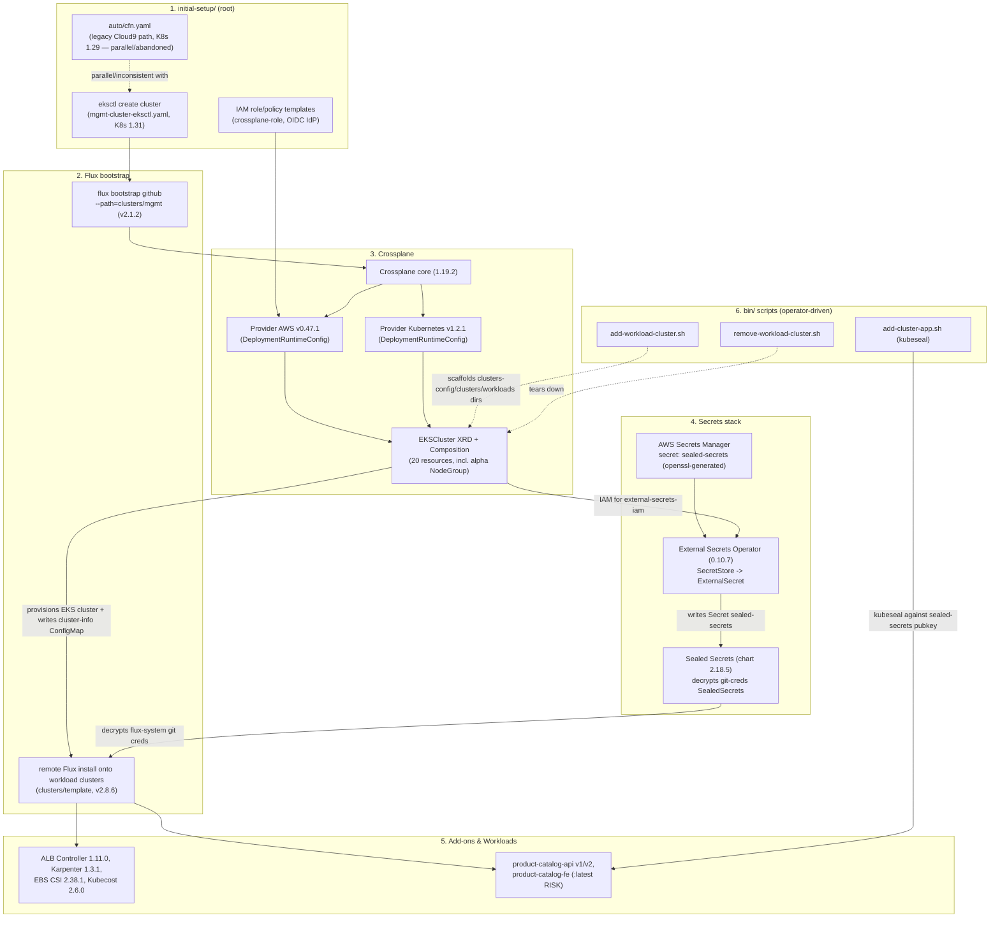

# Component Inventory — eks-multi-cluster-gitops

**Generated:** 2026-07-22 (Layer 1 of the modernization effort — read-only inventory, no code changes made)
**Method:** 6 parallel read-only agents, each independently deriving findings from the actual files in this checkout. `docs/knowledge-base.md` (an existing, unverified prior-analysis doc claiming "Phases 1-9 modernization already applied") was explicitly excluded as a source of truth for this pass — see [Note on `docs/knowledge-base.md`](#note-on-docsknowledge-basemd) at the end.

---

## 0. Summary — what's actually true right now

- The repo is **further along than the original modernization prompt assumed** on several fronts: Flux is already on GA APIs (`v1`/`v2`, no `v1beta1`/`v2beta1` anywhere), Crossplane already uses `DeploymentRuntimeConfig` (not the deprecated `ControllerConfig`), and the AWS provider in use is `crossplane-contrib/provider-aws:v0.47.1` — not the fully-archived original `crossplane/provider-aws` monolith (though it is still the older non-split provider, see Risks).
- The repo has **two live generations of the same automation** in several places (`bin/add-cluster.sh` vs `bin/add-workload-cluster.sh`; `bin/remove-cluster.sh` vs `bin/remove-workload-cluster.sh`; `initial-setup/config/mgmt-cluster-eksctl.yaml` (K8s 1.31, current path) vs `initial-setup/auto/cfn.yaml` (K8s 1.29 default, apparently-abandoned Cloud9/CodeBuild path)) — a real source of confusion for a "frictionless demo."
- **Flux itself has a real version-drift bug**: the mgmt cluster's committed `gotk-components.yaml` is stamped Flux `v2.1.2`, while the workload-cluster template's is stamped `v2.8.6`. Every new workload cluster runs newer Flux controllers than the hub reconciling it.
- **Several concrete breakages exist today**, independent of any future K8s/EKS version bump: the `product-catalog-fe` container image uses a floating `:latest` tag in *both* prod and staging overlays; the `product-catalog-api` v2-staging Kustomize overlay references a `../../base` directory that doesn't exist in the repo (would fail `kustomize build` as checked in); and a Crossplane `Table` (DynamoDB) claim for v2-staging appears completely unwired from any Flux `Kustomization`/`GitRepository` — orphaned.
- **Design assumptions that are load-bearing and must be respected in Layer 2**: the pre-seeded (not autogenerated) Sealed Secrets keypair in AWS Secrets Manager, retrieved via External Secrets Operator before Flux/Sealed-Secrets can bootstrap a workload cluster's Git access — and the `cluster-info` ConfigMap substitution pattern that threads `ACCOUNT_ID`/`OIDC_PROVIDER`/`CLUSTER_NAME` etc. through nearly every templated manifest via `postBuild.substituteFrom`. Both patterns still hold structurally; neither is deprecated by anything found in this inventory.

---

## 1. Cluster Infrastructure (`initial-setup/`)

### 1.1 Kubernetes / eksctl (primary, actively-used path)

| Component | Pinned version | File : line | apiVersion consumed | Depends on / depended on by |
|---|---|---|---|---|
| EKS control-plane version (mgmt cluster) | `"1.31"` | `initial-setup/config/mgmt-cluster-eksctl.yaml:8` | — | Depended on by kubectl pin (`1.31.0`) and Karpenter v1 API compatibility |
| eksctl config schema | `eksctl.io/v1alpha5`, `kind: ClusterConfig` | `mgmt-cluster-eksctl.yaml:2-3` | eksctl.io/v1alpha5 | Root — consumed by `eksctl create cluster -f ...` |
| eksctl CLI | `v0.208.0` | `initial-setup/README.md:131,138`; `GETTING-STARTED.md:188` | — | Provisions the mgmt cluster everything else runs on |
| managedNodeGroups (mgmt) | `desiredCapacity: 3`, `instanceType: m5.large`, `privateNetworking: true` | `mgmt-cluster-eksctl.yaml:17-27` | — | 4 hardcoded AWS-managed policy ARNs at lines 22-25 |
| `iam.withOIDC` | `true` | `mgmt-cluster-eksctl.yaml:11` | — | Feeds `crossplane-role-trust-policy-template.json` and later IRSA |
| `vpc.nat.gateway` | `Single` | `mgmt-cluster-eksctl.yaml:14-15` | — | Cost tradeoff; single point of failure for mgmt egress |
| Region | placeholder `AWS_REGION`, `sed`-substituted from env var | `mgmt-cluster-eksctl.yaml:7` | — | No hardcoded region in this file |

### 1.2 CLI tool versions pinned in docs

| Tool | Pinned version | File : line |
|---|---|---|
| kubectl | `1.31.0` (`2024-09-12` release) | README.md:69; GETTING-STARTED.md:117 |
| Flux CLI | **unpinned** (installs latest via `fluxcd.io/install.sh` or `brew`) | README.md:84; GETTING-STARTED.md:131,134 |
| kubeseal | `v0.36.6` CLI, must match Sealed Secrets **chart `2.18.5`** (controller `v0.36.x`) | README.md:92-106; GETTING-STARTED.md:145-152 |
| gh CLI | **unpinned** | README.md:117,120; GETTING-STARTED.md:167,170 |
| eksctl | `v0.208.0` | README.md:131,138; GETTING-STARTED.md:188 |
| yq | `v4.44.3` (Linux tarball); **unpinned** via `brew install yq` on macOS | README.md:149; GETTING-STARTED.md:206 |
| envsubst (gettext) | **unpinned** | README.md:164; GETTING-STARTED.md:220 |
| aws-cli | **unpinned**, not mentioned at all | — |

### 1.3 `initial-setup/auto/cfn.yaml` — legacy/parallel Cloud9+CodeBuild bootstrap path

A **second, independent** cluster-bootstrap mechanism, not referenced from README.md/GETTING-STARTED.md, apparently targeting an older repo layout (CodeCommit `product-catalog-*-manifests` repos, not `gitops-workloads`).

| Component | Value | File : line | Note |
|---|---|---|---|
| CFN template format | `"2010-09-09"` | cfn.yaml:1 | |
| `KubernetesVersion` param | default `"1.29"`, allowed `1.27/1.28/1.29` | cfn.yaml:13-20 | **Conflicts with the 1.31 pinned in the primary path** |
| Worker instance type | default `m5.large` | cfn.yaml:21-24 | |
| Cloud9 instance type | `t3.small` | cfn.yaml:35-38 | |
| Cloud9 AMI | default `amazonlinux-2-x86_64`; **allows `ubuntu-18.04-x86_64` (EOL)** | cfn.yaml:39-45 | |
| Repo clone URL | hardcoded `github.com/aws-samples/eks-multi-cluster-gitops.git` (upstream fork) | cfn.yaml:51-54 | Not this repo's own remote |
| Flux version (Cloud9 install script) | `FLUX_VERSION=0.35.0` | cfn.yaml:266 | Differs from unpinned primary path |
| eksctl / kubeseal / yq / helm (Cloud9 install script) | **all "latest"** | cfn.yaml:248,256-260,284-304 | Unpinned |
| CodeBuild image | `aws/codebuild/amazonlinux2-x86_64-standard:3.0` | cfn.yaml:1262 | |
| CodeBuild/Lambda runtime | `python: 3.8` (EOL) | cfn.yaml:1298-1299, 1463 | |
| VPC CIDR / subnets | `10.0.0.0/16`, 2 public + 2 private, 2 AZs | cfn.yaml:1519-1585 | Same single-NAT pattern |

### 1.4 IAM role/policy templates

| Template | File | Placeholders |
|---|---|---|
| Crossplane trust policy | `initial-setup/config/crossplane-role-trust-policy-template.json` | `${ACCOUNT_ID}`, `${OIDC_PROVIDER}` — no literal account ID committed |
| Crossplane permission policy | `initial-setup/config/crossplane-role-permission-policy-template.json` | `${ACCOUNT_ID}`; broad `Resource: "*"` on most statements |
| Cloud9 role permission policy (legacy) | `initial-setup/config/cloud9-role-permission-policy-template.json` | `${ACCOUNT_ID}`, `${AWS_REGION}`; superset incl. `iam:CreateUser`; DynamoDB scoped to `table/products-*` — vestige of an older demo layout |
| OIDC provider | created implicitly by `iam.withOIDC: true`; `$OIDC_PROVIDER` re-derived per cluster | README.md:295-301 | RECREATE-MGMT-CLUSTER.md explicitly warns the OIDC URL changes on every recreate |

### Risks — Cluster Infrastructure

1. **Two conflicting K8s versions pinned in the same layer** (1.31 primary vs. 1.29-default legacy `cfn.yaml`).
2. **`cfn.yaml` appears stale/abandoned** — different repo layout, clones the upstream fork not this repo.
3. Multiple **"latest"-pinned tools inside `cfn.yaml`'s install script** (eksctl, kubeseal, yq, helm).
4. **Flux CLI unpinned** in the primary docs; `cfn.yaml` pins an old `0.35.0` — no single reproducible tool matrix exists.
5. gh CLI / envsubst unpinned (low risk).
6. kubeseal/chart coupling is **prose-only**, not enforced by any manifest or script.
7. Python 3.8 / AL2 CodeBuild image in `cfn.yaml` (legacy path only).
8. `ubuntu-18.04-x86_64` listed as an allowed (EOL) Cloud9 AMI.
9. Broad `Resource: "*"` IAM on the Crossplane/Cloud9 policies — likely by design for a demo, but real blast radius.
10. `AdministratorAccess` recommended as the operator's local IAM identity minimum (GETTING-STARTED.md:66).
11. No canonical default region — README suggests `us-east-1`, a script's example text uses `eu-central-1`.
12. Single NAT Gateway for the mgmt cluster — SPOF for all private-subnet egress on the cluster running Flux/Crossplane for the whole fleet.

---

## 2. GitOps / FluxCD

### 2.1 Bootstrap / version files

| File | Flux version (header) | Controller images |
|---|---|---|
| `clusters/mgmt/flux-system/gotk-components.yaml` | **`v2.1.2`** | source `v1.1.2`, kustomize `v1.1.1`, helm `v0.36.2`, notification `v1.1.0` |
| `clusters/template/flux-system/gotk-components.yaml` | **`v2.8.6`** | source `v1.8.3`, kustomize `v1.8.4`, helm `v1.5.4`, notification `v1.8.4` |

**Version drift is real and current**: every new workload cluster (from `clusters/template`) runs materially newer Flux than the mgmt hub reconciling it (`v2.1.2` vs `v2.8.6`).

Neither file installs `image.toolkit.fluxcd.io` CRDs (ImageRepository/ImagePolicy/ImageUpdateAutomation) — **despite `GETTING-STARTED.md` and `RECREATE-MGMT-CLUSTER.md` both documenting a bootstrap with `--components-extra=image-reflector-controller,image-automation-controller`.** Docs and committed state disagree; automated image updates are not actually functional.

`gotk-sync.yaml` in both locations is **hand-edited by design**: it ships with a literal `REPO_PREFIX` placeholder, and setup docs instruct a `sed` substitution against it — contradicting its own "DO NOT EDIT" banner, but controlled/documented rather than accidental drift.

### 2.2 Bootstrap flow

- **mgmt**: `flux bootstrap github --path=clusters/mgmt` run directly against the mgmt cluster.
- **workload clusters**: never get a direct `flux bootstrap`. Instead, mgmt's Flux remote-applies `clusters/<name>/flux-system` onto the new cluster via a Kustomization with `spec.kubeConfig.secretRef: <name>-eks-connection`, after IAM/secrets/EKS-cluster provisioning completes (`<name>-eks-cluster` → `<name>-crossplane-iam` → `<name>-external-secrets-iam` → `<name>-external-secrets` → `<name>-external-secrets-config` → `<name>-sealed-secrets` → `<name>-secrets` → `<name>-flux`). Once installed, the workload cluster's own Flux takes over.

### 2.3 GitRepository / HelmRepository / HelmRelease inventory

All Flux objects use current, non-deprecated apiVersions: `source.toolkit.fluxcd.io/v1`, `kustomize.toolkit.fluxcd.io/v1`, `helm.toolkit.fluxcd.io/v2`. **No `v1beta1`/`v2beta1` found anywhere.**

| HelmRelease | Chart | Repo type | Pinned version | Image tag pin |
|---|---|---|---|---|
| `aws-ebs-csi` | aws-ebs-csi-driver | HTTP | `2.38.1` | none (chart default) |
| `aws-load-balancer-controller` | aws-load-balancer-controller | HTTP | `1.11.0` | none |
| `crossplane-core` | crossplane | HTTP (cross-namespace repo ref) | `1.19.2` | none |
| `external-secrets` | external-secrets | HTTP | `0.10.7` | none |
| `karpenter` | karpenter | OCI | `1.3.1` | none (clusterName var-substituted) |
| `kubecost` | cost-analyzer | OCI | `2.6.0` | `forecasting.fullImageName` pinned to `v0.1.6`; frontend/cost-model/network-costs/cluster-controller/prometheus float on chart default tag |
| `sealed-secrets` | sealed-secrets | HTTP | `2.18.5` | none |

**All 7 HelmReleases have an explicit pinned chart version — no unpinned/`"*"`/`latest` charts anywhere.**

### 2.4 `postBuild.substituteFrom` usage

Nearly every per-cluster Kustomization substitutes from a `ConfigMap` called `cluster-info` (on the workload cluster) or `cluster-info-<cluster>` (on mgmt) — generated by the Crossplane EKS composition itself. This is the mechanism that threads `${ACCOUNT_ID}`, `${OIDC_PROVIDER}`, `${CLUSTER_NAME}` etc. into otherwise-generic templated manifests without per-cluster hand-editing.

### Risks — GitOps/Flux

1. **Flux version drift mgmt (v2.1.2) vs. template (v2.8.6)** — real, current, not hypothetical.
2. **`image.toolkit.fluxcd.io` documented but not installed** — docs/reality mismatch; automated image updates don't work despite being described as configured.
3. `gotk-sync.yaml` hand-edited by design (documented, low severity, but fragile if the sed step is ever skipped).
4. kubecost sub-component images float on chart-default tags (partial pin only).
5. `crossplane` root Kustomization uses `force: true` — blunt tool, can cause unexpected resource replacement.
6. Cross-namespace HelmRepository reference for crossplane-core (inconsistent vs. every other tool, not a bug).

---

## 3. Crossplane

### 3.1 Core & Providers

| Component | Version | Package | File |
|---|---|---|---|
| Crossplane core (Helm) | `1.19.2` | `https://charts.crossplane.io/stable` | `tools/crossplane/crossplane-core/crossplane-release.yaml` |
| Provider AWS | `v0.47.1` | `xpkg.upbound.io/crossplane-contrib/provider-aws` | `tools/crossplane/crossplane-aws-provider/aws-provider.yaml` |
| Provider Kubernetes | `v1.2.1` | `xpkg.upbound.io/crossplane-contrib/provider-kubernetes` | `tools/crossplane/crossplane-k8s-provider/k8s-provider.yaml` |

**Both providers already use `DeploymentRuntimeConfig` (`pkg.crossplane.io/v1beta1`) — no `ControllerConfig` objects exist anywhere in the repo.** This is `crossplane-contrib/provider-aws` (the community-maintained successor), **not** the fully-archived original `crossplane/provider-aws` monolith — but it is still the older non-split monolithic provider rather than the newer per-service "provider-family-aws" (provider-aws-ec2, provider-aws-eks, provider-aws-iam, etc.).

### 3.2 ProviderConfigs

| Name | apiVersion | Auth |
|---|---|---|
| `default` (AWS) | `aws.crossplane.io/v1beta1` | `InjectedIdentity` (IRSA via `crossplane-role`) |
| `k8s-providerconfig` | `kubernetes.crossplane.io/v1alpha1` | `InjectedIdentity`, bound to `cluster-admin` via a Job/CronJob (see risk below) |
| `remote-k8s-providerconfig-<claim>` | `kubernetes.crossplane.io/v1alpha1` | `Secret` (the new workload cluster's own kubeconfig) — lets Crossplane write objects **into** the cluster it just created |

### 3.3 XRD + Composition — `EKSCluster` / `amazon-eks-cluster`

- XRD: `apiextensions.crossplane.io/v1 CompositeResourceDefinition`, group `gitops.k8s.aws`, kind `EKSCluster`, served version `v1beta1` only.
- Composition: classic patch-and-transform (not the newer Composition Functions pipeline), **20 named resources** (VPC, IGW, 4 subnets, 2 EIPs, 2 NAT GWs, 3 route tables, EKS Cluster, EKS NodeGroup, OIDC IdP, mgmt-side ConfigMap, remote ProviderConfig, remote Namespace, remote ConfigMap).
- `NodeGroup` uses **`eks.aws.crossplane.io/v1alpha1`** (alpha API) — the one clearly-alpha managed-resource kind in the composition.
- The `mgmt` cluster itself is **not** provisioned via this composition — it's the hub, provisioned by `eksctl` in `initial-setup/`; Crossplane here only provisions spokes.

### 3.4 Hardcoded / fragile values in the composition

| Location | Value | Note |
|---|---|---|
| `cluster-oidc-idp` resource | thumbprint `9e99a48a9960b14926bb7f3b02e22da2b0ab7280` hardcoded | No automated refresh if AWS rotates the signing CA |
| `eks-nodegroup` resource | `instanceTypes: [m5.large]` hardcoded | Not exposed via XRD schema despite exposing `workload-type` |
| `eks-nodegroup` resource | `minSize: 1` hardcoded | Only desired/max wired to `workers-size` param |
| claim template (`clusters-config/template/def/eks-cluster.yaml`) | fixed CIDR `10.20.0.0/16` + all subnet CIDRs, `eks-k8s-version`/`mng-k8s-version: '1.31'` | Multiple clusters from this template would CIDR-collide if ever peered |

### 3.5 Orphaned / broken resource

`repos/apps-manifests/product-catalog-api-manifests/v2-staging/kubernetes/overlays/staging/infra.yaml` — a Crossplane `Table` (DynamoDB) claim, `dynamodb.aws.crossplane.io/v1alpha1` (alpha). **No Flux `Kustomization`/`GitRepository` anywhere in `gitops-system` references it**, and its own `kustomization.yaml` points at a `../../base` directory that **doesn't exist** in the repo. Appears to be dead/incomplete, not currently deployable as checked in.

### Risks — Crossplane

1. **Alpha APIs in active use**: `eks.aws.crossplane.io/v1alpha1 NodeGroup` and `dynamodb.aws.crossplane.io/v1alpha1 Table`.
2. No Renovate/Dependabot for `xpkg.upbound.io` packages — pins are exact but not automatically kept current.
3. Still on the monolithic `crossplane-contrib/provider-aws` rather than the split family providers (not archived, but increasingly legacy).
4. Orphaned/broken DynamoDB manifest (see 3.5).
5. Hardcoded OIDC thumbprint, instance type, min node count, per-cluster CIDRs — all single points of manual maintenance.
6. **`crossplane-k8s-provider-config/k8s-providerconfig.yaml` runs a `Job`+`CronJob` (image `bitnami/kubectl:1.31`) that grants `cluster-admin` to the provider-kubernetes service account every 3 minutes, matched by package-revision naming** — privileged, self-modifying automation; real blast-radius concern.

---

## 4. Secrets Stack (Sealed Secrets + External Secrets Operator)

### 4.1 Versions

| Component | Version | File |
|---|---|---|
| Sealed Secrets chart | `2.18.5` (controller `v0.36.x` per docs — **not pinned in the HelmRelease itself**) | `tools/sealed-secrets/sealed-secrets-release.yaml` |
| External Secrets Operator chart | `0.10.7` (**no controller/CRD version documented anywhere**) | `tools/external-secrets/external-secrets-release.yaml` |
| kubeseal CLI (docs) | `v0.36.6` | README.md, GETTING-STARTED.md |

The kubeseal↔chart version coupling ("chart 2.18.5 → controller v0.36.x → kubeseal v0.36.6") is **asserted only in prose** (README.md, GETTING-STARTED.md, CLAUDE.md) — nothing in the HelmRelease manifest itself pins an image tag, so nothing enforces this at install time.

### 4.2 Key pre-seeding flow (design pattern — still load-bearing)

1. **Generate keypair with `openssl`** (not kubeseal): 4096-bit RSA + self-signed cert, 3650 days.
2. **Upload to AWS Secrets Manager** as a flat-named secret **`sealed-secrets`** (confirmed independently via IAM policy ARN pattern and `clean-up/README.md`'s delete step).
3. **ESO retrieves it into each cluster**: `ServiceAccount` (IRSA) → `SecretStore` (`external-secrets.io/v1beta1`, provider `aws.SecretsManager`) → `ExternalSecret` (`external-secrets.io/v1beta1`, refresh `1h`) → target `Secret sealed-secrets` (type `kubernetes.io/tls`, labeled `sealedsecrets.bitnami.com/sealed-secrets-key: active` so the Sealed Secrets controller adopts it).
4. Dependency chain per workload cluster: `eks-cluster → crossplane-iam → external-secrets-iam → external-secrets (Helm) → external-secrets-config (SecretStore/ExternalSecret) → sealed-secrets (Helm) → secrets (applies the flux-system git-creds SealedSecret) → flux (remote Flux install)`.

This pre-seeded-keypair design is **exactly** what the original prompt's "design assumes old behavior" question was asking about — verdict: **the pattern still holds and is not deprecated by anything found**; it is in fact necessary given how the bootstrap chain is ordered (Flux itself can't start on a workload cluster until its own git-creds SealedSecret can be decrypted).

### 4.3 SealedSecret resources in the repo

Three static, pre-committed `SealedSecret` (`bitnami.com/v1alpha1`) objects: mgmt→gitops-system git creds, mgmt→gitops-workloads git creds, and a per-app template. **No automation re-seals any of these on keypair rotation** — `bin/add-cluster-app.sh` is the only script that ever calls `kubeseal`, and it takes the public `.pem` as a caller-supplied argument rather than fetching the live cert.

### Risks — Secrets Stack

1. **RISK — controller image versions not pinned in-repo** for both Sealed Secrets and ESO; only chart versions are pinned, controller versions are prose-only claims.
2. **RISK — no automated re-seal on key rotation.** Rotating the AWS Secrets Manager `sealed-secrets` value permanently orphans every existing `SealedSecret` in the fleet, including the ones that bootstrap Flux itself.
3. **RISK — single point of failure with no backup/versioning story in code** for the `sealed-secrets` AWS Secrets Manager secret (only a delete step is automated in `clean-up/`, no backup/restore).
4. HelmRepository URLs have no digest/chart-content pinning beyond the version string (generic Flux supply-chain risk, flagged here because these two gate the whole secrets trust chain).
5. `bin/add-cluster-app.sh` accepts a caller-supplied `.pem` with no validation against the live cluster's actual public cert.

---

## 5. Add-ons & Workloads

### 5.1 Cluster add-ons

| Add-on | Chart | Repo type | Version | Namespace |
|---|---|---|---|---|
| AWS Load Balancer Controller | aws-load-balancer-controller | HTTP | `1.11.0` | kube-system |
| Karpenter | karpenter | OCI | `1.3.1` | kube-system |
| AWS EBS CSI Driver | aws-ebs-csi-driver | HTTP | `2.38.1` | kube-system |
| Kubecost | cost-analyzer | OCI | `2.6.0` | kubecost |

All four add-ons' IAM (ServiceAccount + Crossplane `Role`/`Policy`/`RolePolicyAttachment`) transitively depend on Crossplane core + AWS provider being reconciled first. Karpenter's controller IAM further depends on `karpenter-node-role` existing before the controller policy's `iam:PassRole` can resolve (documented repo history calls this out as a required-ordering race, commit `4c5a4a5`).

**Karpenter `EC2NodeClass` uses `amiSelectorTerms: [{alias: al2023@latest}]`** — floats to whichever AL2023 AMI is newest at node-launch time; no reproducibility/rollback of node AMI version.

### 5.2 Application stack

| App | Base image | Language | Dependency pinning |
|---|---|---|---|
| product-catalog-api v1 | `python:3.12-slim` (floating tag, no digest) | Flask/flask-restx | `requirements.txt` fully exact-pinned (`==`) |
| product-catalog-api v2 | `python:3.12-slim` (floating tag, no digest) | Flask/flask-restx | Same `requirements.txt`, byte-identical Dockerfile to v1 |
| product-catalog-fe | `node:22-slim` (floating tag, no digest) | Express/EJS | `package.json` uses **caret ranges** (`^1.7.4` etc.), not exact pins; `prom-client ^14.0.1` is a stale major (15.x+ available) |

Kubernetes manifests: all Deployments (`apps/v1`), Services (`v1`), Kustomizations (`kustomize.config.k8s.io/v1beta1`) use current, non-deprecated apiVersions. No HPA manifests exist anywhere in `apps-manifests/`.

**Concrete breakages found:**
- `product-catalog-fe-manifests` prod **and** staging overlays both hardcode `image: public.ecr.aws/h2c3y9h0/multi-cluster-gitops/product-catalog-fe:latest` — floating tag in production.
- `product-catalog-api-manifests/v2-staging/kubernetes/overlays/staging/kustomization.yaml` references `resources: [../../base, infra.yaml]`, but **no `v2-staging/kubernetes/base/` directory exists** in the repo — this overlay would fail `kustomize build` as checked in.

`gitops-workloads/` in this repo contains **only a template** — no per-cluster/per-app wiring is statically checked in; it's generated at provisioning time by `bin/add-cluster-app.sh`. This means the actual live wiring for any real deployed cluster cannot be audited from static files alone.

### Risks — Add-ons & Workloads

1. **`:latest` image tag in fe prod+staging overlays.**
2. Floating base images (`python:3.12-slim`, `node:22-slim`) — no digest pin, all three apps.
3. Unpinned/caret npm dependency ranges for product-catalog-fe.
4. `prom-client` stale major.
5. Karpenter AMI floats on `al2023@latest`.
6. Kubecost sub-component images unconfirmed/possibly-floating (cross-ref GitOps section 2.3).
7. **`v2-staging` base directory missing — broken Kustomize build.**
8. DynamoDB claim uses alpha Crossplane API and is orphaned (cross-ref Crossplane section 3.5).
9. gitops-workloads wiring not statically auditable (generated, not committed).
10. product-catalog-api v1 vs v2 share an identical Dockerfile/requirements.txt — only the app code and the (broken) infra.yaml differ.

---

## 6. Tooling & Scripts

### 6.1 `bin/` scripts

| Script | Purpose | Key tools invoked | Notable fragility |
|---|---|---|---|
| `add-app-cluster-overlay.sh` | Scaffold a new Kustomize overlay for an app-manifests repo | none (pure shell) | No `set -e` |
| `add-cluster-app.sh` | Add an app to a cluster's `gitops-workloads` entry | `yq` (v4 syntax), `kubeseal`, `sed -i ''` | **BSD-only `sed -i ''`**; no `set -e` |
| `add-cluster.sh` | Older cluster-scaffolding script | `yq` (v4), `sed -i ''` | Same BSD-sed issue; no `set -e`; **superseded by `add-workload-cluster.sh`** but both still exist |
| `add-workload-cluster.sh` | Newer, hardened cluster-scaffolding script | `yq` (v4), `sed -i ''` | Has `set -euo pipefail` and name validation, but **still uses BSD-only `sed -i ''`** |
| `connect-to-cluster.sh` | Fetch a workload cluster's kubeconfig, export `KUBECONFIG` | `kubectl` | Fixed output filename `~/.kube/wl-kube.conf` — connecting to a 2nd cluster overwrites the 1st; must be `source`d, easy to misuse |
| `remove-cluster-app.sh` | Remove an app from a cluster | `yq` (v4) | No `set -e`, no quoting on `rm -rf` path |
| `remove-cluster.sh` | Older, local-file-only cluster removal | `yq` (v4) | No `set -e`; **superseded by `remove-workload-cluster.sh`** but both still exist |
| `remove-workload-cluster.sh` | Full deprovision: git commit/push, Flux reconcile, poll Crossplane teardown, strip stuck finalizers | `yq`, `git`, `flux`, `kubectl`, `aws` | Has `set -euo pipefail`; text-parses `kubectl get managed`/`kustomization` output by substring match (fragile across Crossplane versions); unconditional finalizer-stripping with no confirmation; hardcoded `--region eu-central-1` in one echoed hint (cosmetic only) |
| `update-cluster-app.sh` | Bump an app's git ref tag | `yq` (v4) | No `set -e`, no existence check |

### 6.2 `clean-up/README.md` — manual teardown runbook (documentation, not scripts)

Documents `eksctl delete cluster`, `gh repo delete`, and multiple `aws` CLI teardown steps. One JMESPath query (`starts_with(@,'prod')`) for DynamoDB table cleanup may be looser than intended (actual table prefix elsewhere is `product-`) — worth verifying in Layer 2. `eksctl delete cluster` does not delete the VPC — documented as a manual follow-up step.

### 6.3 Python / JS

- `repos/apps/product-catalog-api/{v1,v2}/app.py` — no `subprocess`/`os.system`/shell-outs; out of scope for CLI-tooling risk.
- `repos/apps/product-catalog-fe/server.js` — no shell-outs; loads Tailwind from a public CDN at runtime with no version pin (`cdn.tailwindcss.com?plugins=forms`) — a runtime third-party dependency, flagged for completeness.

### Risks — Tooling & Scripts

1. **`sed -i ''` (BSD/macOS-only) in `add-cluster-app.sh`, `add-cluster.sh`, `add-workload-cluster.sh`** — hard-fails on Linux/GNU sed. Not portable to Linux CI/Cloud9.
2. **Inconsistent `set -e`/`set -euo pipefail`** — only the two newest scripts (`add-workload-cluster.sh`, `remove-workload-cluster.sh`) have it; the other seven don't.
3. No direct `eval`-on-untrusted-input found, but several scripts interpolate `$cluster_name`/`$app_name` unquoted into `yq` expression strings without validating the format first (only `add-workload-cluster.sh` regex-validates).
4. `yq` v4 syntax used consistently throughout, but **no yq version pinned/documented for script execution** (only pinned for the manual initial-setup install) — a contributor with `yq` v3 (Python-yq, incompatible CLI) would break every script.
5. **Duplicate script generations coexist** (`add-cluster.sh`/`add-workload-cluster.sh`, `remove-cluster.sh`/`remove-workload-cluster.sh`) with `bin/README.md` documenting only the older pair — unclear which is "the" supported entrypoint.
6. `connect-to-cluster.sh` fixed kubeconfig filename overwrites across clusters.
7. `remove-workload-cluster.sh`'s `kubectl get managed`/`kustomization` substring-grep parsing is fragile across tool/provider version changes.
8. Blunt unconditional finalizer removal in `remove-workload-cluster.sh` (correct semantics, no confirmation gate).
9. Tailwind CDN dependency with no version pin in `views/index.ejs` (supply-chain/reproducibility, not a CLI risk).

---

## Dependency Graph

---

## Consolidated Risk Register (unpinned / hardcoded / broken)

| # | Severity | Item | Section |
|---|---|---|---|
| 1 | High | Flux version drift: mgmt `v2.1.2` vs workload template `v2.8.6` | 2 |
| 2 | High | `product-catalog-fe` uses `:latest` image tag in prod **and** staging | 5 |
| 3 | High | `product-catalog-api` v2-staging Kustomize overlay references missing `base/` dir — broken build | 5 |
| 4 | High | Two conflicting K8s versions in `initial-setup/` (1.31 vs 1.29-default legacy `cfn.yaml`) | 1 |
| 5 | Medium | No automated re-seal of SealedSecrets on keypair rotation — can brick Flux bootstrap fleet-wide | 4 |
| 6 | Medium | `sed -i ''` (BSD-only) in 3 `bin/` scripts — breaks on Linux | 6 |
| 7 | Medium | Duplicate script generations with unclear canonical entrypoint (`add-cluster.sh` vs `add-workload-cluster.sh`, etc.) | 6 |
| 8 | Medium | `image.toolkit.fluxcd.io` documented as bootstrapped but not actually installed | 2 |
| 9 | Medium | Orphaned/broken DynamoDB (`Table`) Crossplane claim, alpha API, unwired from Flux | 3, 5 |
| 10 | Medium | Karpenter `EC2NodeClass` AMI floats on `al2023@latest` | 5 |
| 11 | Medium | Sealed Secrets / ESO controller versions are prose-only claims, not pinned in any manifest | 4 |
| 12 | Medium | `crossplane-k8s-provider-config` CronJob grants `cluster-admin` every 3 min via revision-name matching | 3 |
| 13 | Low-Med | `cfn.yaml` unpinned tool installs (eksctl/kubeseal/yq/helm "latest") — legacy path only | 1 |
| 14 | Low-Med | Floating Dockerfile base images (`python:3.12-slim`, `node:22-slim`) — no digest pins | 5 |
| 15 | Low-Med | product-catalog-fe npm deps use caret ranges, not exact pins; `prom-client` stale major | 5 |
| 16 | Low | Hardcoded OIDC thumbprint, instance type, min node size, per-cluster CIDRs in the Composition | 3 |
| 17 | Low | Kubecost sub-component images partially unpinned (repository only, no tag) | 2, 5 |
| 18 | Low | Inconsistent `set -e` usage across `bin/` scripts | 6 |
| 19 | Low | Broad `Resource: "*"` IAM policies for Crossplane/Cloud9 roles (plausibly by design) | 1 |
| 20 | Low | No canonical default AWS region across docs/scripts | 1 |

---

## Scope note

Per user decision (2026-07-22): the CloudFormation/Cloud9 bootstrap path (`initial-setup/auto/cfn.yaml`, section 1.3 above, and risk items #2, #3, #4 as they relate to `cfn.yaml`) is **out of scope for Layer 2 and beyond**. It will not be modernized, migrated, or referenced in `docs/UPGRADE_PLAN.md`. The eksctl-based path (`initial-setup/config/mgmt-cluster-eksctl.yaml`) is the only supported cluster bring-up mechanism going forward. Consider removing `initial-setup/auto/` entirely as part of implementation, pending user confirmation at that stage.

## Note on `docs/knowledge-base.md`

This inventory was produced **without** trusting the repo's existing `docs/knowledge-base.md` (dated 2026-04-27/28, claiming a prior "Phases 1-9" modernization pass). Cross-checking now that Layer 1 is done: most of that doc's version claims (Crossplane 1.19.2, Karpenter 1.3.1, ALB Controller 1.11.0, EBS CSI 2.38.1, Kubecost 2.6.0, ESO 0.10.7, Sealed Secrets 2.18.5, Flux GA APIs, `DeploymentRuntimeConfig` migration) **check out against the fresh inventory above**. Its three flagged "Future Projects" (FP-1 provider-aws family migration, FP-2 Flux binary upgrade, FP-3 OIDC thumbprint) also match this inventory's independent findings. Where this inventory differs/adds: the Flux **version drift between mgmt and template** (not mentioned in knowledge-base.md), the **broken `v2-staging` Kustomize base** and **`:latest` fe image tag**, the **orphaned DynamoDB claim**, the **`cfn.yaml` parallel/conflicting legacy bootstrap path**, and the **duplicate-generation `bin/` scripts** — none of which knowledge-base.md called out. Treat knowledge-base.md as directionally reliable for component versions but not exhaustive; this document is now the fresher, independently-verified baseline.
